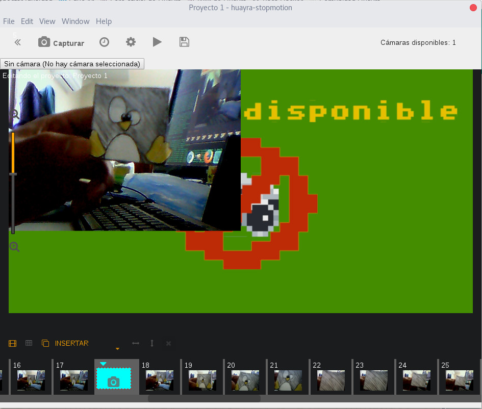
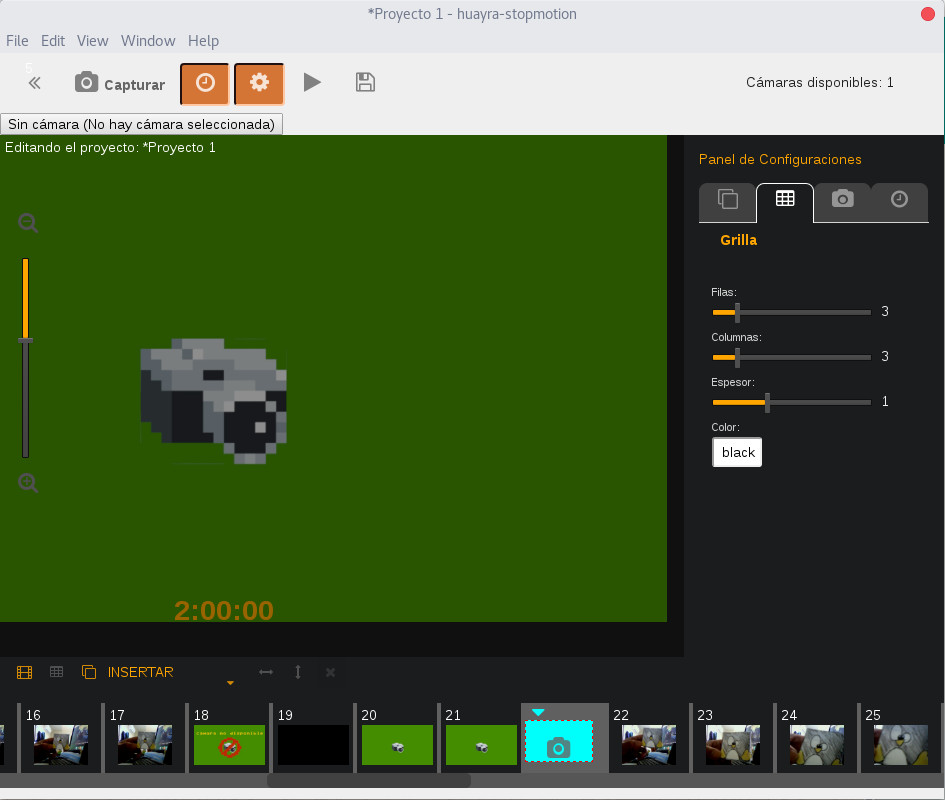

# Huayra-stopmotion

Huayra Stopmotion es un programa para realizar animaciones con una cámara web. En este branch estamos trabajando para actualizar la interfaz y añadir varias mejoras.

## Nuevas features y correcciones

* Panel de configuración se puede ocultar maximizando la vista del proyecto
* Flip horizontal y vertical puede aplicarse en la imagen al guardar
* Modo temporizador mejorado, sin límites para el retardo y con contador en pantalla.
* Edición de línea de tiempo corregida
* Zoom en la vista de cámara

## Dependencias

Para poder instalarlo necesitarás las siguientes dependencias

* [Git](https://git-scm.com/)
* [Node.js](https://nodejs.org/) (with NPM)
* [Ember CLI](https://ember-cli.com/)
* [Google Chrome](https://google.com/chrome/)

## Instalación y ejecución

* `git clone <repository-url>` este repositorio
* `cd huayra-stopmotion`
* `npm install`
* `ember b`
* `electron .`

