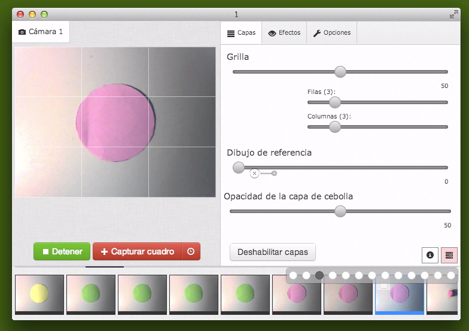
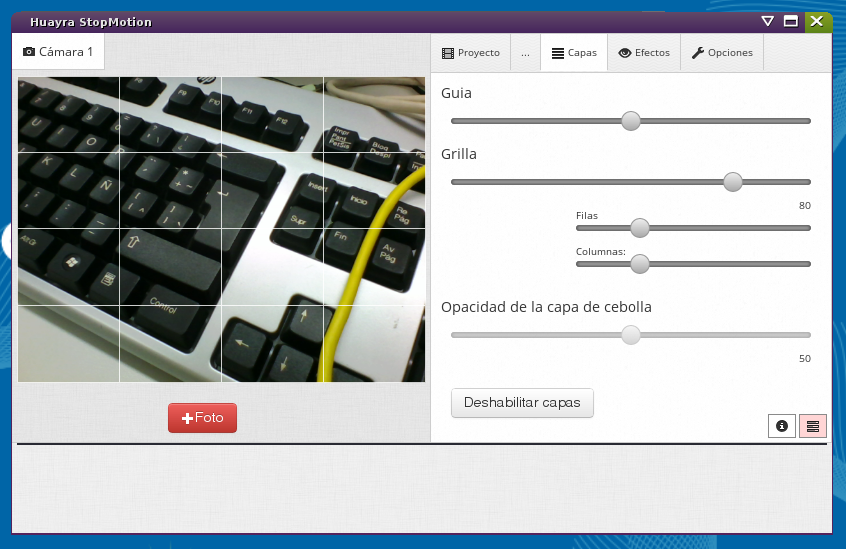

huayra-motion
=============

**huayra-stopmotion** es una herramienta libre para realizar cortos animados usando la técnica de animación stopmotion.

¿Cómo iniciar la aplicación?
----------------------------

Este software funciona sobre GNU/Linux, MacOSX y Windows.

Podés descargar las versiones binarias para *Linux*, *Mac OSX* o
*Windows?* aquí:

- [Descargar](http://dev-losersjuegos.com.ar/huayra-motion)

## Tecnologías utilizadas

* nodewebkit
* angularjs
* express.js
* socket.io

¿Cómo compilar la aplicación completa?
--------------------------------------

Si querés compilar y desarrollar la aplicación desde el código
fuente primero tenés que clonar el repositorio:

	➤ git clone https://github.com/HuayraLinux/huayra-stopmotion.git

Luego tenes que asegurarte de tener instalado node.js, por ejemplo la versión 0.10:

	➤ node -v
	v0.10.18
	
Si no tenés node, tendrías que instalarlo antes. Hay unas recetas de instalación en
estas webs:

- [Como instalar nodejs en huayra-linux](http://examplelab.com.ar/como-instalar-nodejs-en-huayra-linux/)
- [how-to-install-nodejs](http://howtonode.org/how-to-install-nodejs)
	
Luego de tener nodejs, hay que instalar todas las dependencias de la aplicación
usando estos comandos:

	➤ sudo npm install bower -g
	➤ cd huayra-stopmotion
	➤ make init
	
por último, usando el comando **make** vas a ver las opciones de lanzamiento:

	➤ make
	test           Prueba la aplicacion usando nodewebkit en linux.
	test_mac       Prueba la aplicacion usando nodewebkit en mac osx.
	instalar       Instala node webkit para linux.
	instalar_mac   Instala node webkit para mac osx.
	build          Genera las versiones compiladas.
	
por ejemplo ``make test`` o ``make build``.

Colaboración
------------

**huayra-stopmotion** es software libre, está en una etapa de desarrollo muy temprana, y aún nos quedan mil cosas por hacer!

Estamos desarrollando esta aplicación con el objetivo de incluirlo en la próxima versión de [huayra GNU/Linux](http://huayra.conectarigualdad.gob.ar/), para que llegue a todos los chicos de las escuelas secundarias en Argentina.

Te invitamos a participar junto a nosotros del desarrollo, podés clonar el repositorio, realizar pull-requests, darnos ideas de mejoras, probar la aplicación etc…
